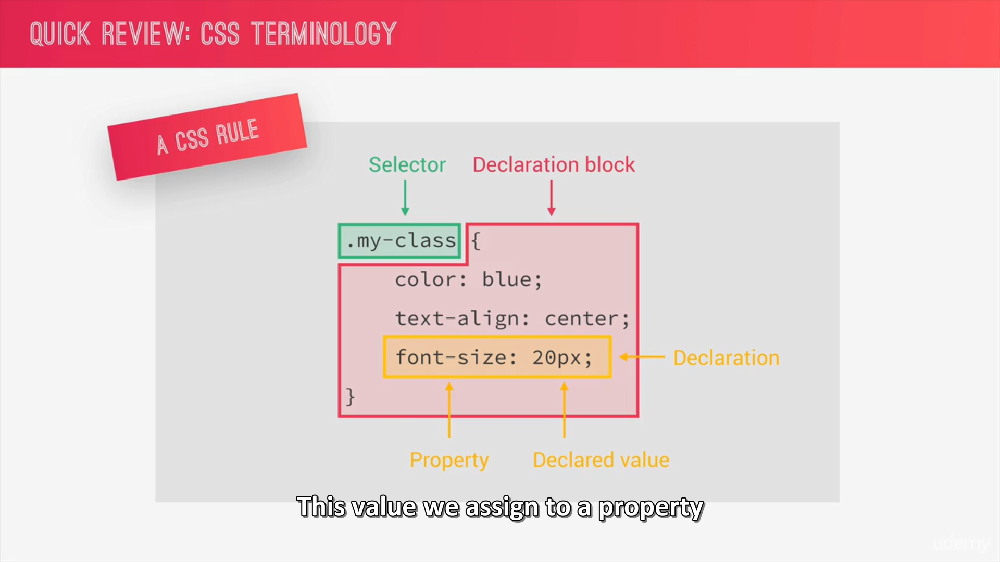
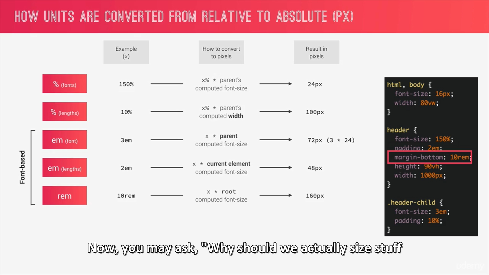
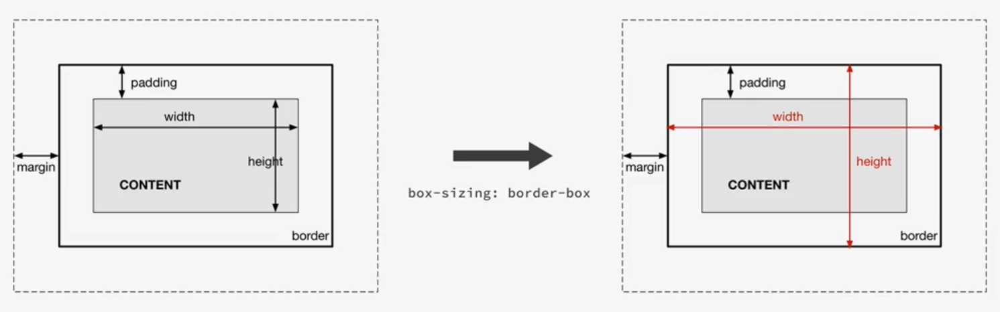

# Advanced CSS
From [Udemy - Advanced CSS and Sass Flexbox, Grid, Animations and More!](https://www.udemy.com/course/advanced-css-and-sass/)

## Natours project
[Natours - WIP](https://nathalie-anneessens.github.io/advanced-CSS/Natours)
<!-- **TODO**
- [ ] Change units from PS to REM and add  -->

### Passe 1 - CSS
- [x] Header HTML + CSS
- [x] Header CSS better practices
- [X] Header implement BEM
### Passe 2 - HTML & SASS
- [x] Intro Section
- [x] About Section
- [x] Features Section
- [x] Tours Section
- [ ] Stories Section (WIP)
- [ ] Booking Section
- [ ] Footer
- [ ] Navigation
### Passe 3 - Responsive
- [ ] Responsive

## Trillo Project (Flexbox 305)
## Nexter Project (Grid 305)

### Notes
___
#### **Visual Studio Code**
- **CTRL +D** : Select terms to modify all at the same time

#### **CSS good practices**
- Begin project with the usual *, *::before, *::after {} for padding and margin to zero **AND** add box-sizing:inherit; + body {box-sizing:border-box;} 
- Put font-family into the body and not into the * selector.
- **CSS Termonology**
  
- **Using REM instead of px for lenght units** to simplify responsive design > put **html {font-size:~~10px~~ 62.5%;}** ( % to not overwrite the browser parameters written by the user) to html selector
- When we have a point, don't write the 0 > ~~0.5rem~~ > **.5**rem
  
#### **New stuff learned right now**
- **Multiple background** (image + gradient/color) : background-image:*gradient*,*image url* ; 
- **clip-path**:polygon (Top Left, Top Right, Bottom Right, Bottom Left); same effect than fusion mask on Photoshop each point takes X and Y coordonate
- Don't use more than 2 properties in keyframes animation (opacity and transform)
- **animation-iteration-count** : x; > repeat X time the animation
- **animation-timing-function** : linear, ease in ease on stuff
- **backface-visibility** : hidden > hack for unwanted animation shake comming from ... who knows ?🤷🏾‍♀️ . To put on the container of animated stuff 
- More than one transform > **transform : transform1() transform2();** no comma
- **.class:link** : link is a state of the button selector. Best practice to use **a:link** also
- **all in one animation** : name, animation duration, animation timing function, animation delay;
- **animation-fill-mode** : backwards > Automaticaly apply the styles up to zero percent before the animation starts.
- **Units conversions**

- **Box model** : Fill area = content + padding + border (area that gets filled with background color or background image)
- **Box-sizing:border-box**

  Dimensions will be for the entire fill area, not just for the content area
- **Component-driven design**
  
- **BEM**
  
- **Architecture folders : 7-1 pattern**
  
  - base : basic product definitions [???]
    - utilities : classes with a unique and simple goal
  - components : one file for each component
  - layout : to define the overall layout of the project
  - pages : style for specific pages of the project
  - themes : if we use different visual themes
  - abstracts : no css, but variables, functions and mixins
  - vendors : where all third part CSS goes
- **Comments in SASS** //comment
- **Nesting**
- 

- **Mixin** : reusable piece of code > @mixin name {}
  
  
- **Placeholder and extend** : for elements who looks almost exactly alike 
  
- **Command line ls** are not working on windows. Instead use "dir"

- **Command to convert** : sass sass/input.scss css/output.css
- **Command to watch** : sass --watch input.scss output.css
- **Using Calc with variables** : Put the variable beetwin brackets with the # before > width:calc((100% - **#{** $gutter-horizontal **}**) / 2);
- **Select all of the elements in which the class attribute START with "col-"** > [class^="col-"]{}
- **Select all of the elements in which the class attribute END with "col-"** > [class$="col-"]{}
- **Select all of the elements in which the class attribute CONTAIN "col-"** > [class*="col-"]{} 
- **To add a gradient to a text** : 
  - background: linear-gradient(#eee, #333);
  - webkit-background-clip: text;
  - webkit-text-fill-color: transparent;
- **background-blend-mode** : to blend 2 images like with "mode" from Photoshop
- **box-decoration-break:clone;** : /! dont forget the -webkit- ! specifies how an element's fragments should be rendered when broken across multiple lines, columns, or pages.
  - **clone**  apply all the declarations that we have in the selector to all of the box created by an element. > One element, two boxes, both styled
  
- **Shape-outside: circle(50% at 50% 50%);0** : create a circle for text "habillage". Need to specify width, height, and be floating.
- **objct-fit : cover;** : like background-size. /! fill will fucked up the aspect ration
- **adjacent siblings selector** : 
  - direct AFTER"+"
  - AFTER but not directly "~"
- **!important use** : only in the utilities classes
- **cubic-bezier** : [https://easings.net/](https://easings.net/) & [https://cubic-bezier.com/](https://cubic-bezier.com/)